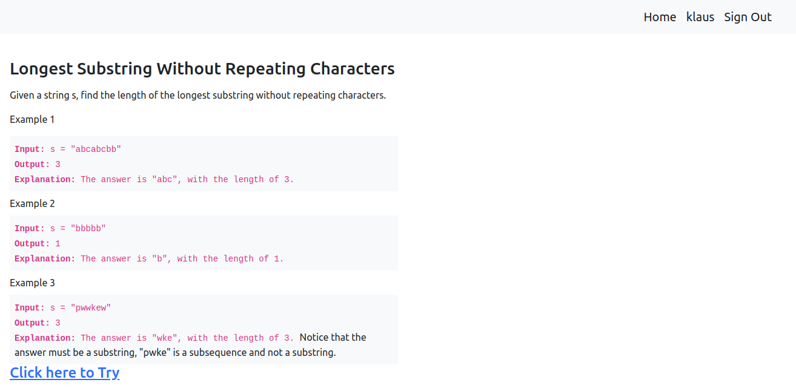

# Longest String App built with Ruby on Rails

## About the Project

The main goal for this project was to create Rails app that contails following functionallity:
- should have a form with atleast one field e.g name
- submission of the form should redirect user to the show page where it shows longest string without repeating charcters i.e if name is pwwkew it should print on screen 'wke' and length of that string 3. 
- the url of the show page should have `/name`.

**Nice to have features**
- login functionallity
- validation field

## Built With

* [Ruby on Rails](https://rubyonrails.org/)
* [Ruby](https://www.ruby-lang.org/en/)

## Live Demo

[Live Demo Link](https://frozen-caverns-25964.herokuapp.com/login)

## Getting Started

To get a local copy up and running follow these simple example steps.
- [ ] Open your terminal
- [ ]  Navigate to the directory where you will like to install the repo by running `cd FOLDER-NAME` 
- [ ] Clone this repository
 > `git clone https://github.com/Div685/Longest-string-Rails-app.git`
- [ ] To install all dependencies and necessary gems, run `bundle installl`, `yarn install`
- [ ] Run `rails db:setup`
- [ ] Run `rails server` to run rails application in your local server
- [ ] Run `rspec` to run rspec tests

## Author

👤 **Divyesh Patel**

- GitHub: [@Div685](https://github.com/Div685)
- Twitter: [@div_685](https://twitter.com/div_685)
- LinkedIn: [Divyesh Patel](https://www.linkedin.com/in/divyesh-daxa-patel/)

## Contributing

Contributions, issues, and feature requests are welcome!
Feel free to check the [issues page](../../issues).

1. Fork the Project
2. Create your Feature Branch (`git checkout -b feature/AmazingFeature`)
3. Commit your Changes (`git commit -m 'Add some AmazingFeature'`)
4. Push to the Branch (`git push origin feature/AmazingFeature`)
5. Open a Pull Request

## Show your support

Give a ⭐️ if you like this project!